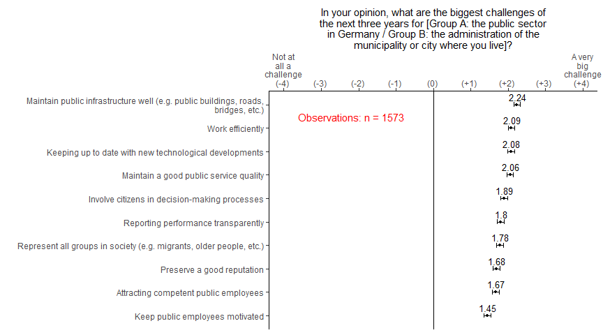
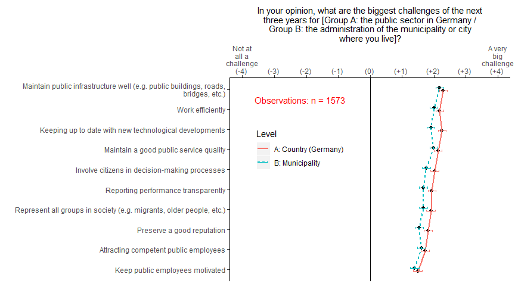
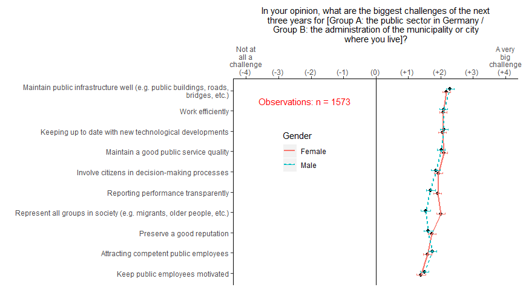
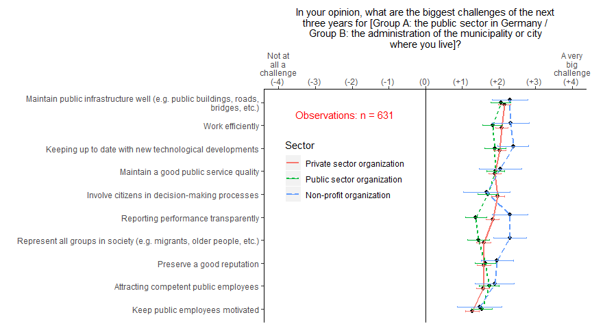
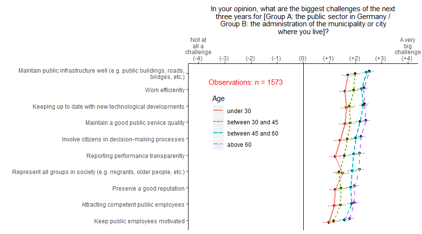
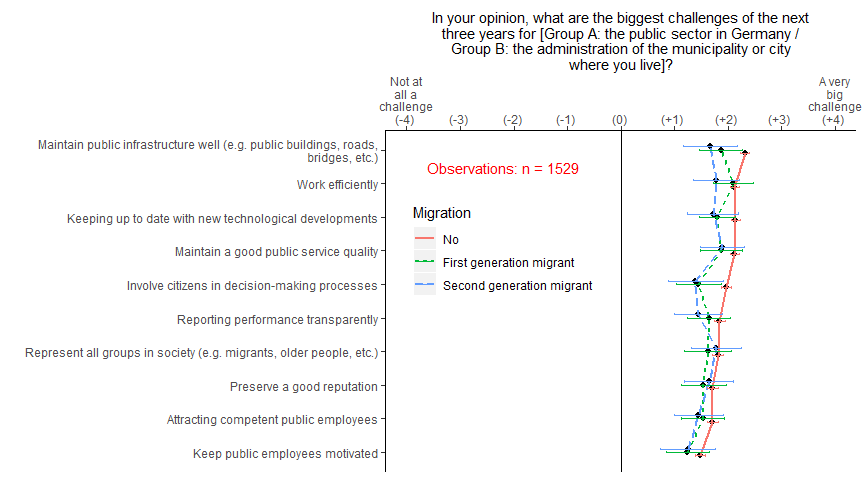
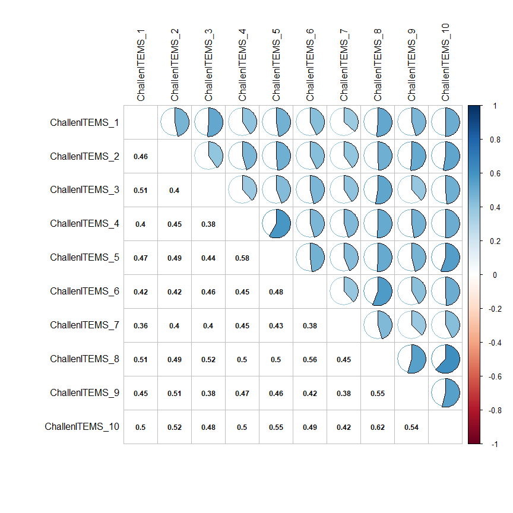

The biggest public sector challenges in Germany - A citizen perspective
================
Jurgen Willems, Lisa Schmidthuber, Moritz Schmid, Monika Knassmüller,
Falk Ebinger, Katharina Dinhof

(January 2021)

[**Institute for Public Management &
Governance**](https://www.wu.ac.at/en/pubmgt/institute "Institute for Public Management & Governance")

WU - Vienna University of Economics and Business

Welthandelsplatz 1, Building D2, Entrance E (level 1)

1020 Vienna

Austria

**Reference:** Willems, J., Schmidthuber, L., Schmid, M., Knassmüller,
M., Ebinger, F., & Dinhof, K. (2021, January 15). The biggest public
sector challenges in Germany - A citizen perspective. OSF Preprints.
DOI: <http://dx.doi.org/10.31219/osf.io/qe2sh>

# Summary

**Background:** This report provides insights into citizens’ perceptions
on current challenges for the public sector, both for the German public
sector as a whole and for cities and municipalities. In a representative
survey, respondents were asked about the challenges the public sector is
facing, by evaluating ten different topics. Based on the ranking of
topics and comparisons across subgroups, we can provide an insight into
citizens’ expectations in order to set priorities in public
administration research and policy development.

**Data & methods:** We started from ten different topics that are often
dealt with in scientific as well as practice debates. These ten topics
are: (1) attract competent public sector employees, (2) keep up to date
with new technological developments, (3) keep public employees
motivated, (4) involve citizens in decision-making processes, (5) report
performance transparently, (6) preserve a good reputation, (7) represent
all groups in society (e.g. migrants, older people, etc.), (8) maintain
a good public service quality, (9) maintain public infrastructure
(e.g. public buildings, roads, bridges, etc.), and (10) work
efficiently. For these ten topics, survey items were developed for the
respondents to assess the extent that they are considered major
challenges for the next three years, using a 9-point Likert scale
(ranging from (-4) “No challenge at all” to (+4) “A very big
challenge”).

Moreover, the sample was randomly split, where one group (Group A) was
asked to assess the biggest challenges for the German public sector as a
whole, and the other group (Group B) assessed the same challenges for
the public sector at the city or municipality level. The following
questions were asked (in German):

  - ***Group A***: “In your opinion, what are the biggest challenges
    facing Germany’s public sector in the next three years?” (“Welches
    sind Ihrer Meinung nach die größten Herausforderungen für den
    öffentlichen Sektor in Deutschland in den nächsten drei Jahren?”)
    (49.33 percent of all respondents).

  - ***Group B***: “In your opinion, what are the biggest challenges for
    the next three years for the administration of the municipality or
    city where you live?” (“Welches sind Ihrer Meinung nach die größten
    Herausforderungen der nächsten drei Jahre für die Verwaltung der
    Kommune oder Stadt, in der Sie leben?” (50.67 percent of all
    respondents).

By comparing responses between those groups, we can assess whether
challenges are perceived differently for these two adminstrative levels.

Respondents were approached by use of a professional panel provider
(Qualtrics Panels) and sampled according to the criteria of
representativeness for region (Bundesland), age, and gender. In total,
1573 respondents completed the survey. Additional background variables
were asked regarding education, occupation, and sector of employment
(see table below for descriptive statistics).

**Results:** For the graphs in this study, perceived challenges are
ranked based on the sample mean, from ‘biggest challenge’ (top of the
graph) to (relatively) least a challenge (bottom of the graph). Mean
values are illustrated with a dot, along with the 95%-confidence
interval around the mean. For the overall reporting of mean values for
the total sample, item mean scores are also given above the confidence
intervals. For other figures in this study, graphs report differences
for subgroups based on the demographic variables.

**Main findings:** All ten topics are, on average, rated as a
substantial challenge, i.e. mean values are at the positive side of the
response scale (i.e. towards “a very big challenge”). The top-three
challenges perceived by citizens are: (1) maintain public
infrastructure, (2) work efficiently, and (3) keep up to date with new
technological developments (Figure 1). Except for the observation that
challenges are rated as slightly less substantial for the city and
municipality level (compared to the German public sector as a whole),
there are no substantial differences for perceived challenges between
the public sector as a whole in Germany at the one hand and cities and
municipalities on the other hand (Figure 2). In other words, we do not
observe any challenges that are particularly specific to the national
level or to the level of cities and municipalities. Therefore, we
combine the answers of both groups (A and B) to clarify differences for
other demographic variables (Figures 3 to 6).

Furthermore, the results show no major gender differences, except for
women assessing the challenge even bigger of having all societal groups
sufficiently represented in public administrations (related to
representative bureacracy) (Figure 3). When comparing responses based on
sector of employment, public sector employees deviate most from
employees in the for-profit and non-profit sectors on at least some of
the topics. Compared to employees in the nonprofit sector, public sector
employees rate transparent performance reporting as well as representing
all societal groups as less challenging. In contrast, public sector and
nonprofit employees have a similar view of the magnitude of the
challenge posed by citizen participation in decision-making (Figure 4).
There also appears to be an age effect, with older people seeing all ten
issues as more challenging on average (Figure 5). In comparison,
migrants perceive various topics as less challenging, which might
indicate a different mental reference framework of migrants when
evaluating a challenge in Germany, for example compared to their country
of origin (Figure 6).

Download original figures – in German and English – [here (Willems et
al., 2021)](https://figshare.com/articles/figure/The_biggest_public_sector_challenges_in_Germany_-_A_citizen_perspective/13581050)

The raw data is available at: <https://osf.io/uv928/>

# General overview (Figure 1)

<!-- -->

All topics are, on average, rated as a substantial challenge, i.e. mean
values are at the positive side of the response scale (towards “a very
big challenge”). This is hardly surprising, but rather confirms our
starting point, namely that these topics represent current and relevant
issues. However, the order derived from the rating is interesting:

Firstly, the top-three items – ‘maintain public infrastructure’, ‘work
efficiently’, and ‘keep up to date with new technological developments’
– refer (at least partly) to the provision of public services and the
efficiency of the public tasks. Immediatly thereafter, maintain a good
public service quality, is ranked. These results show that citizens
regard service provision as most challenging, indicating that their
perception of a challenge is probably strongly connected to their needs
or expectations what to receive (individually) from the public
authorities.

Secondly, the following three items in the list show a gradual change of
focus from the individual to a more social level: involve citizens in
decision-making processes, report transparently on performance, and
represent all groups in society. The order moves from the individual to
the societal level.

[**Figure download** (in English or
German)](https://figshare.com/articles/figure/The_biggest_public_sector_challenges_in_Germany_-_A_citizen_perspective/13581050)

# German public administration as a whole versus city and municipality administration (Figure 2)

<!-- -->

Except for the observation that challenges are rated as slightly less
substantial for the city and municipality level (compared to the German
public sector as a whole), there are no substantial differences for
perceived challenges between the overall public sector in Germany at the
one hand, and cities and municipalities on the other hand (Figure 2). In
other words, we do not observe any challenges that are particularly
specific to the national level or to the level of cities and
municipalities. Therefore, we combine the answers of both groups (A and
B) to clarify differences for other demographic variables (Figures 3 to
6).

[**Figure download** (in English or
German)](https://figshare.com/articles/figure/The_biggest_public_sector_challenges_in_Germany_-_A_citizen_perspective/13581050)

# Gender (Figure 3)

<!-- -->

The results show no major gender differences, except for women assessing
the challenge even greater of having all societal groups sufficiently
represented in public administrations (Figure 3).

[**Figure download** (in English or
German)](https://figshare.com/articles/figure/The_biggest_public_sector_challenges_in_Germany_-_A_citizen_perspective/13581050)

# Sector of employment (Figure 4)

<!-- -->

When comparing responses based on sector of employment, public sector
employees mostly rate the topics under study less challenging than
private for-profit and non-profit sectors employees. A closer look shows
that task-oriented topics referring (at least partly) to public service
provision (‘maintain public infrastructure’, ‘work efficiently’, ‘keep
up to date with new technological developments’, ‘maintain a good public
service quality’) together with ‘attract competent employees’ are
perceived more challenging than the more societal issues of
diversity/inclusion, participation, transparency/accountability or
reputation management.

Compared to employees in the public sector, non-profit sector employees
rate ‘report transparently on performance’ as well as the ‘represent all
groups in society’ clearly as more challenging. In general, the (rather
small number) of respondents working in the non-profit sector tend to
view the topics as more challenging than other groups, thereby deviating
particularly strong from the public sector employees’ perception.
However, public sector and nonprofit employees have a similar view of
the magnitude of the challenge posed by citizen participation in
decision-making.

[**Figure download** (in English or
German)](https://figshare.com/articles/figure/The_biggest_public_sector_challenges_in_Germany_-_A_citizen_perspective/13581050)

# Age (Figure 5)

<!-- -->

When participants are differentiated by age, there is a steady increase
in the perceived extent of all challenges with age.

[**Figure download** (in English or
German)](https://figshare.com/articles/figure/The_biggest_public_sector_challenges_in_Germany_-_A_citizen_perspective/13581050)

# Migration (Figure 6)

<!-- -->

With regard to migration background, the results show hardly any
generation differences within the migrants except for ‘work efficiently’
which is perceived as less demanding by the first generation than by the
second generation. However, both groups differ in an almost identical
way from citizens without a migration background who generally perceive
the ten topics as more challenging than migrants. Given the unusual
consistency of the assessments by the two migrant groups, one could
assume that their assessment scheme is fundamentally different from that
of citizens who have lived in Germany for generations. In other words:
Migrants’ frame of reference when evaluating a challenge might be
different. Further research on the specifics of these differences would
be promising and highly relevant, especially with regard to integration
policy and measures.

[**Figure download** (in English or
German)](https://figshare.com/articles/figure/The_biggest_public_sector_challenges_in_Germany_-_A_citizen_perspective/13581050)

# Extras

## Public sector challenges: Items

### English

 - 	ChallenITEMS_1	: 	Attracting competent public employees, 
 - 	ChallenITEMS_2	: 	Keeping up to date with new technological developments , 
 - 	ChallenITEMS_3	: 	Keep public employees motivated, 
 - 	ChallenITEMS_4	: 	Involve citizens in decision-making processes, 
 - 	ChallenITEMS_5	: 	Reporting performance transparently, 
 - 	ChallenITEMS_6	: 	Preserve a good reputation, 
 - 	ChallenITEMS_7	: 	Represent all groups in society (e.g. migrants, older people, etc.), 
 - 	ChallenITEMS_8	: 	Maintain a good public service quality, 
 - 	ChallenITEMS_9	: 	Maintain public infrastructure well (e.g. public buildings, roads, bridges, etc.), 
 - 	ChallenITEMS_10	: 	Work efficiently

### German

 - 	ChallenITEMS_1	: 	Gewinnung von kompetenten Verwaltungsbediensteten, 
 - 	ChallenITEMS_2	: 	In Bezug auf neue technologische Entwicklungen auf dem Laufenden bleiben , 
 - 	ChallenITEMS_3	: 	Die Verwaltungsbedienstete motiviert halten, 
 - 	ChallenITEMS_4	: 	Bürger*innen in Entscheidungsprozesse einbeziehen, 
 - 	ChallenITEMS_5	: 	Transparent über Leistungen berichten, 
 - 	ChallenITEMS_6	: 	Einen guten Ruf bewahren, 
 - 	ChallenITEMS_7	: 	Alle Gruppen der Gesellschaft vertreten (z.B. Migrant*innen, ältere Menschen usw.), 
 - 	ChallenITEMS_8	: 	Eine gute Qualität des öffentlichen Dienstes aufrechterhalten, 
 - 	ChallenITEMS_9	: 	Öffentliche Infrastruktur gut instand halten (z.B. öffentliche Gebäude, Straßen, Brücken usw.), 
 - 	ChallenITEMS_10	: 	Effizient arbeiten

## Correlation of items

<!-- -->

# References

Willems, Jurgen; Schmidthuber, Lisa; Schmidt, Moritz J.; Knassmüller,
Monika; Ebinger, Falk; Dinhof, Katharina (2021): The biggest public
sector challenges in Germany - A citizen perspective. **figshare**.
Figure. <https://doi.org/10.6084/m9.figshare.13581050>
